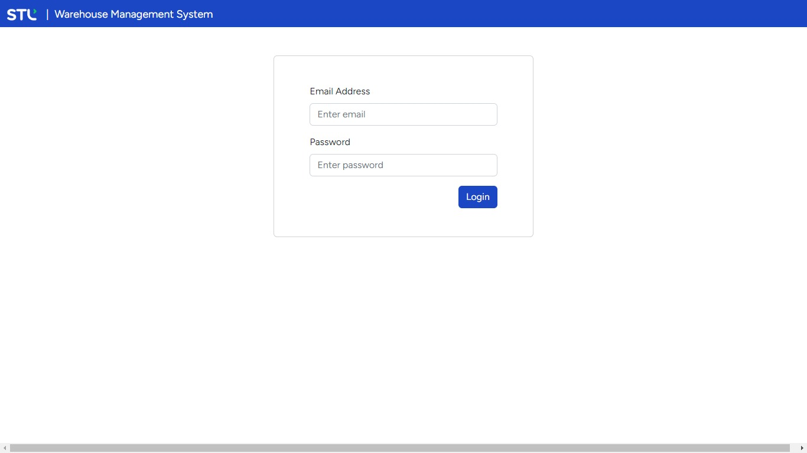
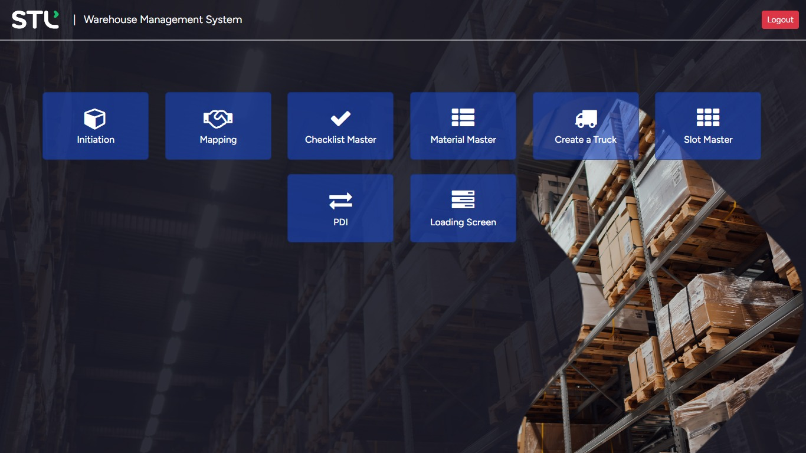

# Warehouse Management System

<!-- ### About

This MERN Full stack web application is an eCommerce Platform built with __React.js__ for frontend,
__Express.js__ for creating REST API, __MongoDB__ for database, __React-Bootstrap__ for the UI library and __Redux__ for managing application states. It supports authentication with JSON Web Token for admin and customer users. Customers can search products by name or brand and Admins can add new products & edit details. It is deployed on __Heroku__. -->

### Login Screen

### Dashboard Screen

### Mapping Screen

### Checklist Master Screen

### Material Master Screen

### Create Material Screen

### Loading Screen

### Add Truck Screen

